# FLIGHTDECK

**Every trade needs clearance.**

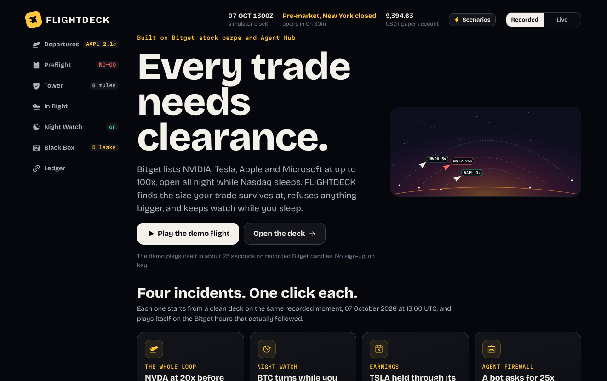

Bitget lists NVIDIA, Tesla, Apple and Microsoft perpetuals at up to 100x, open all night while
Nasdaq sleeps. Most trading agents answer "what should I buy?". FLIGHTDECK answers the question
that decides whether you still have an account next month: **at what size does this trade
survive?**

It stress-tests the plan, refuses anything too large, and in the same breath offers the size it
will clear. It does this for a person and for an AI agent alike. Then it keeps watch while you
sleep, and writes its next rule from your own trading history.

> A liquidated trader pays fees once. A trader who survives keeps trading.
> FLIGHTDECK does not stop the trade. It resizes it.

| | |
|---|---|
| **Live app** | **[flightdeck-xyz.netlify.app](https://flightdeck-xyz.netlify.app/)** (no sign-up, no key) |
| **Demo video and launch thread** | [x.com/flight_deck_xyz/status/2108527661098082811](https://x.com/flight_deck_xyz/status/2108527661098082811) |
| **The study** | [docs/STUDY.md](docs/STUDY.md): 95,886 plans on 40 days of Bitget candles, with the code that produced every table and the checks that tried to break it |
| **Technical document** | [docs/TECHNICAL.md](docs/TECHNICAL.md): every formula, threshold, rule and API call |
| **Evidence files** | [samples/](samples/): paper-trading log, hash-chained ledger, a full preflight report, the learned rules. [research/RESULTS.md](research/RESULTS.md) and [research/AUDIT.md](research/AUDIT.md): every study table as printed |
| **Hackathon** | Bitget AI Hackathon, Season 2 |
| **Track** | AI Trading Desk, sub-theme Decision Stress Testing |
| **X** | [@flight_deck_xyz](https://x.com/flight_deck_xyz) |
| **Repository** | [github.com/crazyydevv/flightdeck](https://github.com/crazyydevv/flightdeck) |
| **Contact** | crazyydevv173@gmail.com |

**Contents:** [Judge it in 60 seconds](#judge-it-in-60-seconds) ·
[The evidence](#the-evidence) · [The problem](#the-problem) · [The loop](#the-loop) ·
[One research task, start to finish](#one-research-task-start-to-finish) ·
[Why this is different](#why-this-is-different) ·
[Against the judging criteria](#against-the-judging-criteria) ·
[Fit with the hackathon](#fit-with-the-hackathon) · [Architecture](#architecture) ·
[Questions a sceptic would ask](#questions-a-sceptic-would-ask) · [Run it](#run-it) ·
[Deploy](#deploy) · [Agents](#agents) ·
[What is and is not verified](#what-is-and-is-not-verified)

---

## Judge it in 60 seconds

1. Open **[flightdeck-xyz.netlify.app](https://flightdeck-xyz.netlify.app/)**. No sign-up and no key.
2. Press **Play the demo flight**. The whole loop plays itself in about 25 seconds.
3. Or pick one of the four incidents on the landing page. Each is one click.

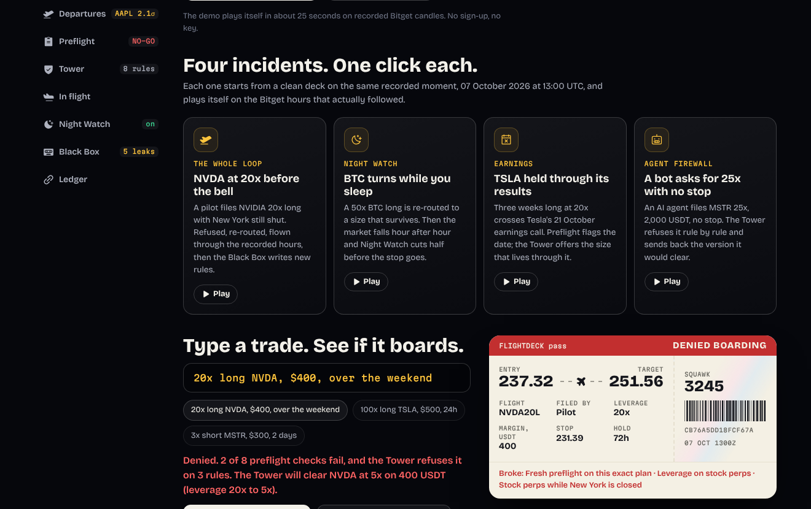

| Scenario | What you see |
|---|---|
| **NVDA at 20x before the bell** | The whole loop: refused, re-routed to 5x, flown, new rules written, an agent turned away. |
| **BTC turns while you sleep** | 50x re-routed to 12x. Night Watch cuts half after four straight hourly closes against the position. |
| **TSLA held through its results** | A three-week hold crosses Tesla's 21 October earnings. Fails at 20x; the Tower clears 4x. |
| **A bot asks for 25x with no stop** | An agent order refused on six rules, with a counter-offer that adds the stop it left out. |

Every scenario starts at the same recorded moment (07 October 2026, 13:00 UTC, half an hour
before the New York bell) and plays on the Bitget hours that actually followed. **No price in
this demo is invented.**

---

## The evidence

A demo shows two trades, and two trades can be picked. So FLIGHTDECK was run on **every trade
the data allows**: every entry hour across 33 days, on 40 days of Bitget candles, eight
contracts, long and short, at 10x, 20x and 50x. Each plan was judged using only candles that had
already closed, then flown through the hours that followed. 95,886 plans in three tests (a
default stop held one day, the same held three days, and no stop at all).

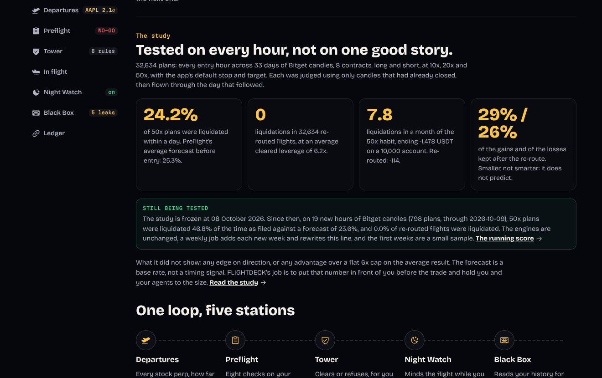

| What was measured | Result |
|---|---|
| A 50x plan with the app's default stop, held one day | **24.2% liquidated.** Preflight's average forecast before entry: **25.3%** |
| The same plan held three days | 50.7% liquidated (forecast 57.6%, seven points too cautious) |
| The plan the app opens with: 20x, three days, stop 2.5% | Never liquidated as filed, but 37.9% of those trades lost more than 2% of the account each |
| Plans with no stop, grouped by Preflight's forecast | forecast 0.4%, measured 0.7% · 2.7%, 2.9% · 12.7%, 13.5% · 29.3%, 25.3% |
| Plans with no stop, by Preflight's runway check | 94% of the liquidations were in plans it fails, 6% in plans it cautions, none in plans it passes |
| Re-routed flights liquidated | **None, in any test.** As filed: 1,881, 3,693 and 2,758 |
| A month of filing the 50x plan once a day | 7.8 liquidations, median loss 1,478 USDT on a 10,000 account. Re-routed: 0 liquidations, 114 USDT |
| What the smaller size costs | Keeps 28% to 29% of the gains and 26% to 27% of the losses |

**And what it did not show**, because a result that only agrees with its author is not a result:

- **No edge.** FLIGHTDECK does not make a trade better per dollar, and does not claim to.
- **A base rate, not a timing signal.** Preflight had the odds right for each kind of plan. At a
  fixed leverage it could not tell which days or contracts would be worse, and did no better
  than quoting the average.
- **No better than a flat cap on average.** "Never more than 6x on anything" carried the same
  exposure to the same average result. The re-route's worst outcomes were better when a plan
  arrived with no stop (it adds one) and worse when the plan carried a fixed stop.
- **Zero liquidations is the leverage, not the cleverness.** No hour in the sample moved far
  enough to reach a liquidation price at 12x or less.
- **Night Watch does not improve the average**, and costs about one USDT per flight once its own
  exits are charged slippage. It trims the worst outcomes of the flights it touches and turns
  some winners into scratches.
- **Forty days of a rising market**, no crash, no earnings date, no gap large enough to test the
  gap check, and last-traded prices where an exchange liquidates on mark price.

The study was then attacked. A second implementation of the flight model reproduces all 95,886
results to the cent. An independent review found no look-ahead and no scoring bug, and several
places where the first draft of the write-up claimed more than the data supports; those claims
were cut back, and the checks that prompted it are in the repository as
[research/AUDIT.md](research/AUDIT.md). No engine file was changed for the study, before or
after.

What FLIGHTDECK adds to a flat leverage cap is not a cleverer number. It is the odds in front of
you before the trade, a stop where one was missing, the same gate applied to AI agents, and a
record of every decision.

**The test keeps running.** The study is frozen at 8 October 2026. From there a scheduled job
pulls each week's new Bitget candles, flies the same plans through them with the engines
unchanged, and commits the score to [research/FORWARD.md](research/FORWARD.md); the app's
landing page shows the running total and updates itself after each run. It keeps score and does
not tune: a system that adjusts its thresholds to fit its own test proves nothing, so any future
rule change has to earn its place on weeks it has never seen. The first run (9 October, 19 entry
hours inside the 7 to 8 October sell-off) had 50x plans liquidated 46.8% of the time against a
forecast of 23.6%, and no re-routed flight liquidated: a base rate does not see a bad day
coming, and the smaller size still held. One day is a small sample.

Full method, all tables, confidence intervals and limits: **[docs/STUDY.md](docs/STUDY.md)**.
Reproduce it with `npm run study`.

### The two demo flights

The engines judged each plan at 13:00 UTC on 7 October using only bars that had already closed.
The flights were then flown through the next 30 recorded hours, which the engines never saw.

| Trade as filed | Flown as filed | Flown through FLIGHTDECK | Difference |
|---|---|---|---|
| NVDA 20x long, 400 USDT | stopped out, **-225.10 USDT** | re-routed to 5x, stopped out, **-56.27 USDT** | 168.82 USDT kept |
| BTC 50x long, 400 USDT | liquidated, **-400.00 USDT** | re-routed to 12x, Night Watch cut half, **-104.83 USDT** | 295.17 USDT kept |

On the BTC flight, Night Watch alone was worth 25.60 USDT: the same cleared flight with the watch
off ended at -130.44.

FLIGHTDECK did not predict either drop. Both trades still lost. It made the losses a quarter of
the size and kept the account alive. Run `npm run demo` to reproduce every number above; the
output is deterministic. These two flights illustrate the mechanism. The study is the evidence.

---

## The problem

**Stock perps are a new kind of risk, and the tools around them were built for the old kind.**

A share of NVIDIA trades six and a half hours a day. Its perpetual on Bitget trades all
twenty-four, at up to 100x. That creates three situations a crypto trader has never had to
think about, and that a signal bot does not think about at all:

1. **The closed market.** For seventeen and a half hours a day, and all weekend, the perp prices
   on its own. When New York opens, the share takes over and the perp snaps to it. A stop does
   not fill inside that jump.
2. **Earnings.** Results come out after the close. The perp takes the entire reaction in one
   move with no share trading behind it. Tesla's worst day in the last ninety sessions was
   15.7%; at 8x that is the whole margin, whatever the stop says.
3. **Leverage built for crypto, applied to a stock.** At 50x the liquidation price is 1.5% away.
   A default 2.5% stop sits behind it and can never fill. In our study that plan was liquidated
   one day in four.

Meanwhile the fashionable thing to build is an agent that decides *what* to buy and is handed
the keys. Nobody is building the thing that stands between that agent and the exchange and asks
how big.

**Who it is for.** Three specific users, not "all traders":

| User | Their problem | What FLIGHTDECK gives them |
|---|---|---|
| A crypto-native trader opening their first stock perps | Carries crypto leverage habits into an instrument with closing bells and earnings | The size that survives the bell, and the reason in one sentence |
| Someone running an AI trading agent on Bitget Agent Hub | The agent can size any order it likes, at any hour | A gate the agent must clear, with a lower limit than its owner and a counter-offer it can act on |
| A trader who keeps blowing up the same way | Knows the habit, cannot stop mid-trade | Rules written from their own history and enforced before the order, not after |

---

## The loop

| Station | What it does |
|---|---|
| **Departures** | A flip-board of Bitget stock perps, the Nasdaq 100 perp and crypto, ranked by how unusually far each moved while its home market was shut, after removing what its benchmark explains (QQQ for stocks, BTC for MSTR and COIN). Shows Bitget's maximum leverage beside the leverage the Tower will clear right now, and the next earnings date. |
| **Preflight** | Eight checks on a plan: liquidation runway, gap shock, earnings, replay through past windows, stop integrity, payoff, costs, account risk. GO, CAUTION or NO-GO. |
| **Tower** | Clears or refuses against a rule set. A refusal comes with a **re-route**: the largest version of the same trade that passes every check and every rule, filed and cleared in one click. Every decision is a boarding pass with a hash, chained into a ledger. |
| **In flight** | The cleared trade flies, on Bitget Demo Trading or the paper book. When it lands it is compared with the size first filed, over the same hours. |
| **Night Watch** | Checks each flight after every hourly candle and acts for you. It can tighten a stop, cut half, or land. It can never add size, widen a stop or remove one. |
| **Black Box** | Reads the logbook for habits that lose money and writes each one up as a new Tower rule. Bring your own Bitget key and it reads your real history. |

| Preflight says no | The Tower refuses, and offers |
|---|---|
| 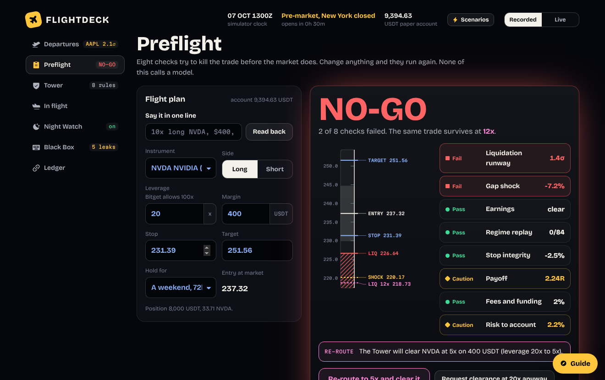 | 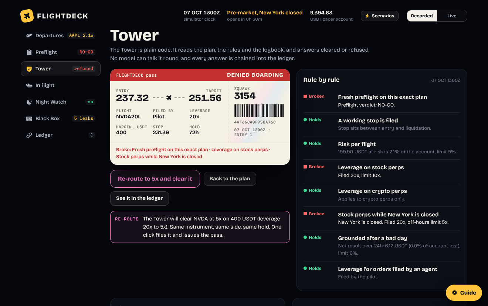 |
| **One click later** | **Landed, with the comparison** |
| 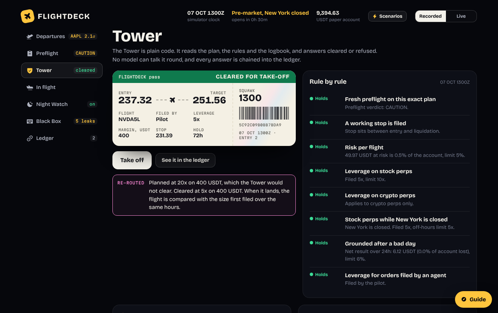 | 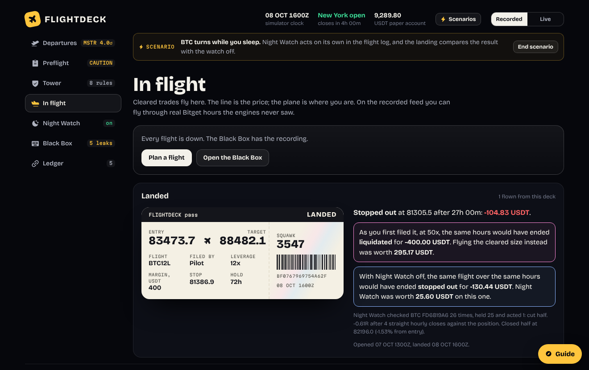 |
| **Departures board** | **An agent is turned away** |
| 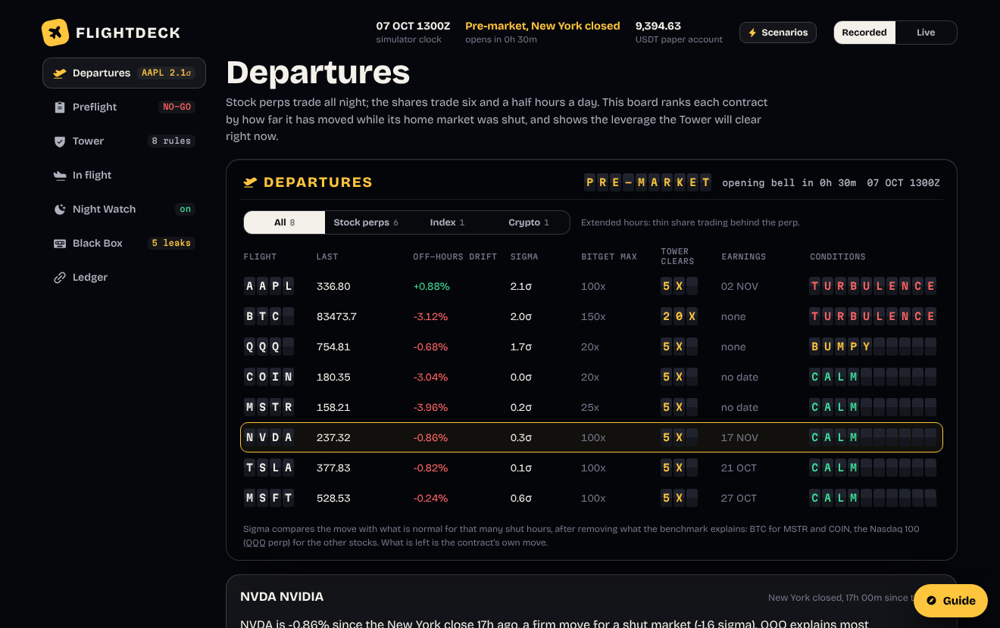 | 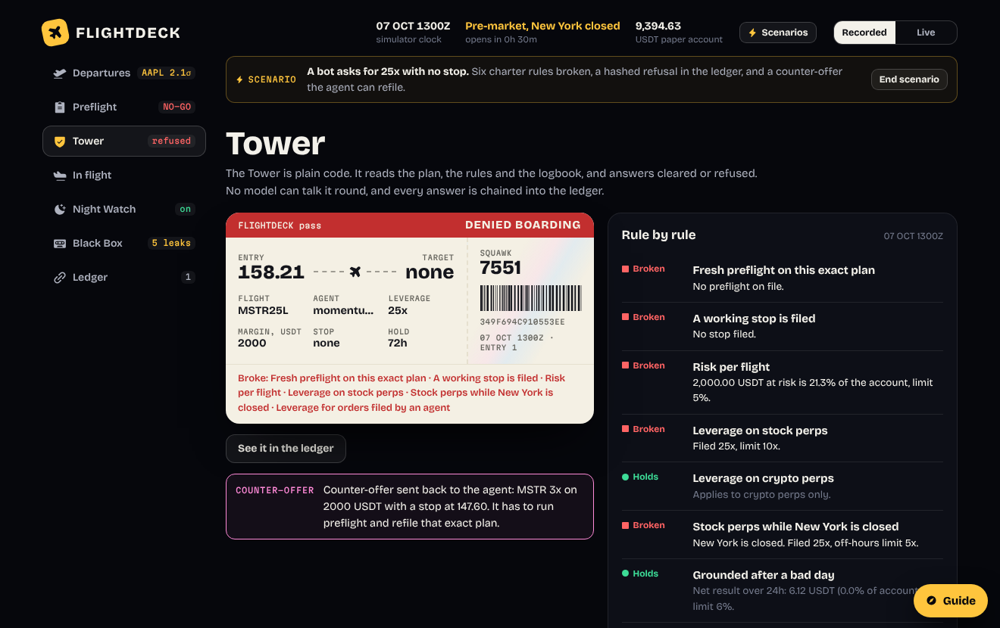 |
| **The Black Box reads the logbook** | **Every decision, hash-chained** |
| 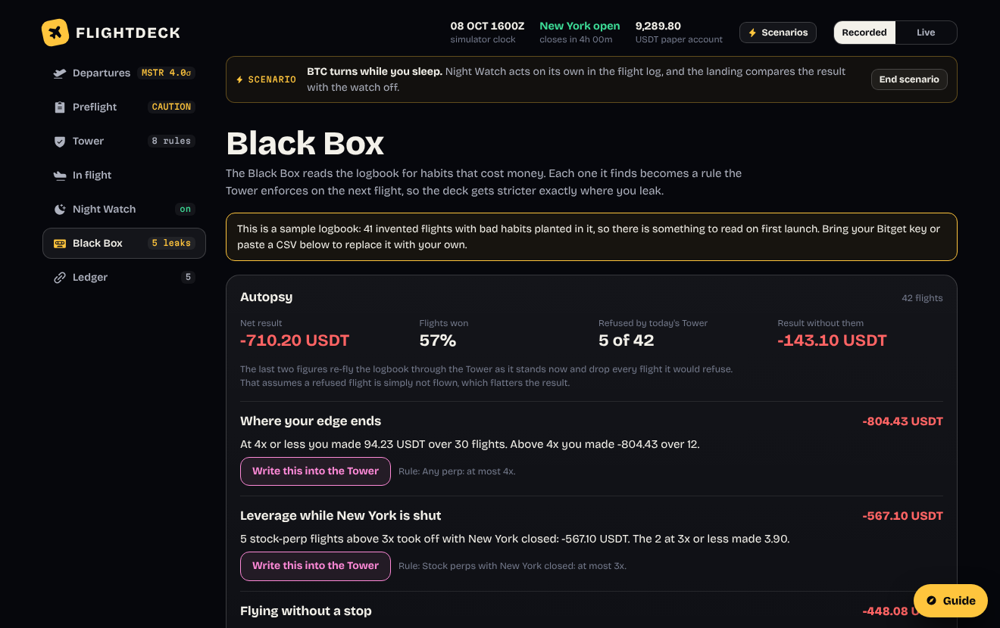 | 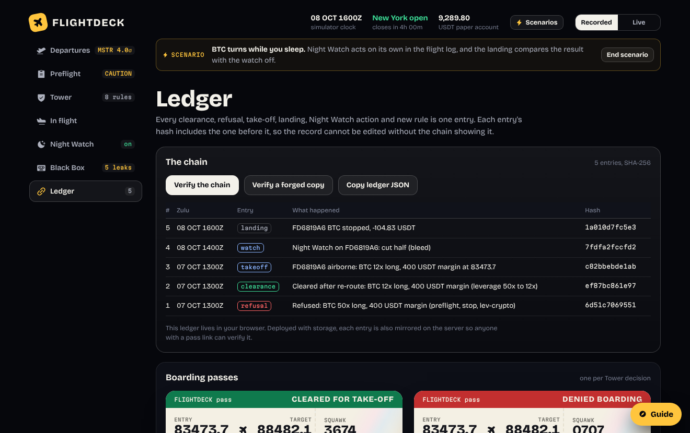 |

---

## One research task, start to finish

The task: *"NVIDIA dipped overnight. Should I go long at 20x into the open and hold through two
sessions?"* Every number below is from the recorded run in [samples/](samples/) and can be
reproduced with `npm run demo`.

**1. Is the dip NVIDIA's own?** Departures shows NVDA down 0.86% since the close, 1.6 sigma for
that many closed-market hours. Its residual against the Nasdaq 100 perp is 0.3 sigma. The index
moved; NVIDIA did not. That is not a reason to trade or not to trade. It tells you what you are
actually buying.

**2. Type the trade.** `20x long NVDA, $400, over the weekend`. The deck answers "Read as: NVDA,
long, 20x, 400 USDT margin, 72h" and fills a stop 2.5% away and a target 6% away. The parser is
plain code, not a model: the same words always give the same plan.

**3. Preflight tries to kill it.**

| Check | Result | Why |
|---|---|---|
| Liquidation runway | **FAIL** | Liquidation at 226.64, 4.5% from entry. A normal 72-hour move in NVDA is 3.1%. That is 1.4 moves; under 2 is a coin toss on noise alone |
| Gap shock | **FAIL** | A 7.2% day liquidates it, and the hold crosses three opening bells, each a chance to gap past the stop |
| Earnings | pass | Lands before NVIDIA reports |
| Regime replay | pass | Flown through 84 past windows: 5 hit target, 32 stopped out, none liquidated |
| Stop integrity | pass | 2.5% away, outside noise and inside liquidation |
| Payoff | caution | 2.24 to 1 needs to win 31% of the time. In the replay it won 14% |
| Fees and funding | pass | 9.60 USDT, 2% of the reward |
| Risk to account | caution | 209.90 USDT at the stop, 2.2% of the account |

Verdict: **NO-GO. Survives at 12x.**

**4. The crew argues.** Three seats (Weather, Engineering, Dispatch) each write a short brief
against the plan, in a model's words when one is configured and from templates when not. They
are handed the eight checks and nothing else, and nothing reads their words back into a decision.

**5. The Tower rules.** Filed at 20x anyway: **REFUSED** on three rules (preflight is NO-GO,
stock perps are capped at 10x, and at 5x while New York is closed). The refusal carries an
offer: *"The Tower will clear NVDA at 5x on 400 USDT."* One click files and clears it. A
boarding pass is issued with the plan's hash.

**6. The flight.** It flies through 30 recorded hours the engines never saw. Night Watch checks
it 28 times and holds every time. NVDA keeps falling and the stop fills at 230.93: **-56.27
USDT.** The same plan as first filed at 20x: **-225.10 USDT.**

**7. The Black Box reads the logbook** and finds six habits that lost money (leverage with New
York shut: 6 flights, -623 USDT; flying without a stop: 3 flights, -448 USDT; and four more).
Five become Tower rules. From then on a revenge trade is refused before it is placed.

**8. The record.** Ten ledger entries, each hashing the one before. Any boarding pass can be
opened by link and is re-verified against its neighbour when read.

**9. Was that one trade typical?** That question is what [the study](docs/STUDY.md) is for.

---

## Why this is different

**1. It sizes the trade; it does not pick it.** Signal bots are judged on being right. FLIGHTDECK
is built for the case where you are wrong, which is most of the cases that end an account.

**2. Math decides. The model only talks.** Verdicts, clearances and the Night Watch guard are
plain TypeScript, the same answer every time, covered by tests. A model writes the crew's
arguments and may pick from Night Watch's fixed menu. It cannot change a verdict, and no prompt
can talk the Tower round.

**3. A refusal ends with an offer.** The Tower does not just say no. It computes the largest
version of the same trade that clears and files it in one click, so the trader still trades and
the exchange still earns the fee, on a position that can survive.

**4. A firewall for AI agents.** The Tower is an MCP server. Any agent files its order there
before Bitget Agent Hub executes. Agents get a lower leverage cap than the pilot, cannot choose
their own entry price, cannot skip preflight, and a refused agent receives a counter-offer it
must refile unchanged.

**5. It keeps watch, inside one hard limit.** Night Watch acts while you sleep, and every action
it can take reduces risk. That limit is enforced by a guard that applies to the built-in rules
and to model output alike, and tested over 300 random flights.

**6. It gets stricter exactly where you leak.** The Black Box reads your own closed positions,
finds the habits that cost money (revenge trades, sizing up after a loss, leverage in shut
markets) and turns each into a rule the Tower enforces from then on.

**7. Its claims were tested, and the test is in the repository.** 95,886 plans, no look-ahead,
confidence intervals, a control, a second implementation, and the findings that do not flatter
it printed beside the ones that do. The data was cross-checked against itself; the check found
two bad bars in our own snapshot, and we fixed them and said so.

---

## Against the judging criteria

The AI Trading Desk track is scored on feature depth, research quality, natural-language
fluency and how personal the thesis is.

| Criterion | What to look at |
|---|---|
| **Feature depth** | Six stations that form one loop, not six screens: a ranked board with benchmark residuals, eight checks, a rule engine with re-route, a paper and demo-order flight book, an overnight monitor with a provable safety limit, a habit detector that writes rules, a hash-chained public ledger, an MCP server for agents, bring-your-own-key history. 64 tests. |
| **Research quality** | [docs/STUDY.md](docs/STUDY.md). An out-of-sample test of the product's own forecasts on 95,886 plans: forecast against outcome, thresholds against outcome, a control rule, day-resampled confidence intervals, split-half stability, a second implementation, a set of changed-assumption checks, a long section on what it does not show, the code to rerun all of it, and a forward test that keeps scoring the frozen engines on each new week of candles. |
| **Natural-language fluency** | A trade is one typed line (`3x short MSTR, $300, 2 days`) and the deck echoes what it read. Every check answers in one sentence a trader can act on. A refusal is a sentence with an offer in it. Night Watch leaves a note for the morning. Three crew seats argue the plan in prose. An agent talks to the same Tower over MCP. |
| **Personalised thesis** | The Tower's rules are yours. The Black Box reads your closed positions (through your own Bitget key, a CSV, or the labelled sample), finds your leaks, and each rule it writes names the flights that justify it. The rule set exports as a licence your agents are held to. |
| **A complete research task** | [Above](#one-research-task-start-to-finish), and in the demo video. |

---

## Fit with the hackathon

Track: **AI Trading Desk.** Bitget describes it as "a natural-language-driven AI research dashboard: AI
processes the information and presents the analysis, while traders make the final call." That is
the shape of FLIGHTDECK: type a trade in one line, the deck does the analysis, and the pilot
decides whether to take off.

| Sub-theme | Where FLIGHTDECK covers it |
|---|---|
| **Decision Stress Testing** (the sub-theme entered) | Preflight's eight checks, replay and reshuffled paths; the crew arguing against the plan; the study that checks the stress test itself |
| Execution Assistance | Tower clearance and re-route, the server-side re-check, Bitget demo orders with preset stop and target, Night Watch |
| Review & Self-Evolution | Black Box autopsy, learned rules, the as-filed and watch-off comparisons on every landing |
| Information Extraction & Signal Generation | Departures: off-hours drift, sigma, residual against QQQ or BTC, session phase, funding, earnings |
| Personalized Research Workbench | A rule set that is yours: learned from your history, exportable as a licence your agents are held to |

### Bitget features used

| Feature | Where |
|---|---|
| Market API v2: tickers, candles (1H, 1D), history candles, contracts | `src/core/bitget.ts`, `api/market.ts`, `research/` |
| Stock perps NVDA, TSLA, AAPL, MSFT, MSTR, COIN; index perp QQQ as the benchmark; live adds META, AMZN, GOOGL, PLTR, SPY, ETH, SOL where listed | Departures, radar residuals |
| `isRwa` flag, max leverage, taker fee, precision, tier-1 maintenance margin | session rules, liquidation price, checks |
| Funding rate, last-vs-index basis | cost check, board readouts |
| Demo Trading (`paptrading: 1`): set-leverage, place-order with preset stop and target, close orders | `api/order.ts`, `api/watch.ts` |
| Account history: `history-position`, `orders-history` | `api/history.ts`, Black Box |
| Agent Hub MCP, `bgc`, `bitget-signal` skills | `mcp/tower.ts`, `skills/flightdeck/SKILL.md` |
| Qwen through the hackathon proxy, or any OpenAI-compatible model | crew, Night Watch |

### Where the AI is, and is not

| | Decided by |
|---|---|
| GO / CAUTION / NO-GO, the surviving size | Code |
| CLEARED / REFUSED, the re-route | Code |
| What Night Watch is allowed to do | Code (the guard) |
| Which allowed action Night Watch picks | Rules, or a model choosing from the same menu |
| The crew's three briefs against your plan | A model, handed the eight checks and nothing else; rule-written when no model is set |
| Whether an agent's order reaches Bitget | Code, through the MCP Tower |

A model that can be wrong is kept away from every decision that can cost money. That is a
design choice, not a missing feature: the study could only be run because the decisions are
deterministic.

---

## Architecture

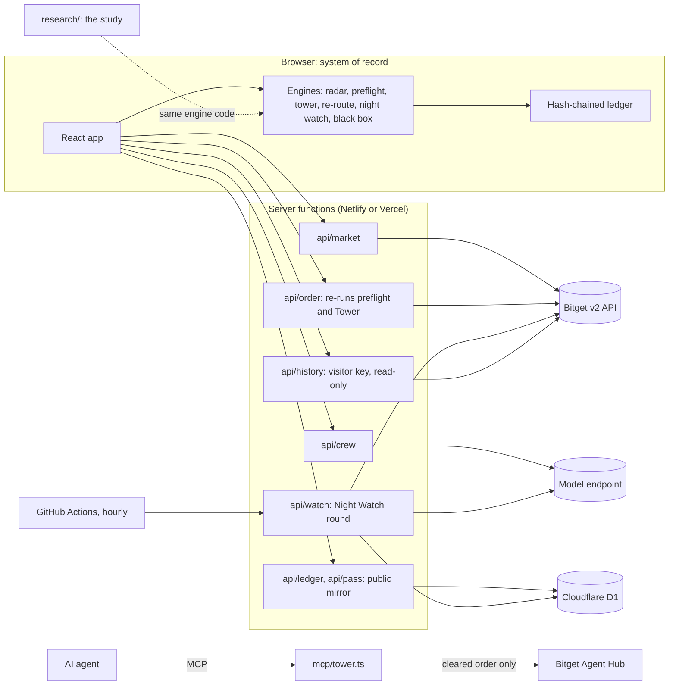

The same engine code runs in the browser, in the server functions, in the MCP server and in the
study. The server trusts nothing the browser says about its own clearance: `api/order` re-runs
Preflight and the Tower on live Bitget data before any order is signed. Formulas, thresholds, the
rule set and the trust model are in [docs/TECHNICAL.md](docs/TECHNICAL.md).

| Layer | Built with |
|---|---|
| App | React 19, TypeScript, hand-written CSS, bundled with esbuild alone |
| Engines | TypeScript with no dependencies, including its own SHA-256 so hashes match in every runtime |
| Server | Nine routes as serverless functions, on Netlify or Vercel |
| Storage | Cloudflare D1 over REST, optional |
| Agents | An MCP server over stdio, no dependencies |
| Tests | 64, on `node:test`, with a mock exchange and a real SQL engine |

---

## Questions a sceptic would ask

**Isn't this just "use less leverage"?**
Largely, yes, and the study says so: a flat 6x cap matched the re-route's average result, and
the absence of liquidations after a re-route is the lower leverage at work. Three things are not
just less leverage. The odds: Preflight said on average that 25.3% of 50x plans would be
liquidated in a day and 24.2% were, so the trader sees a true base rate before the trade, not
after. The stop: when a plan arrives without one, the re-route adds it, and there it beat the
flat cap on the worst outcomes. And the gate: a rule you set for yourself at noon is not a rule
at 3 a.m., and it is not a rule at all for an agent holding your keys.

**Does it make money?**
No. It has no view on direction. In the study the average result of every arm was negative,
because trading every hour in both directions earns you the fees. FLIGHTDECK kept 29% of the
gains and 26% of the losses. What it changes is whether the account survives.

**Can it tell me when a trade is about to go wrong?**
No. Its forecast is a base rate for the kind of plan: how often this leverage, with this stop,
on a market behaving as it recently has, ends in liquidation. In the study it had that rate
right and had no skill at picking the bad day.

**Why would an exchange want traders to trade smaller?**
Because a liquidated account stops paying fees. In the study a month of the 50x habit ended
1,478 USDT down with eight liquidations; the same trader re-routed was 114 down and still
trading.

**Couldn't an agent just ignore the Tower?**
An agent that holds its own exchange keys can. That is why the recommended arrangement is for
the Tower to hold the keys, so the only path to the exchange runs through a clearance. The
technical document says this plainly rather than claiming more.

**How do I know the candles are real?**
They are in the repository with the endpoint they came from. Daily bars rebuilt from hourly
bars match Bitget's own daily bars on all 302 days that were recorded independently both ways.
Switch the app to **Live** and it uses current Bitget data.

**How do I know the engines did not see the future?**
One function hands them the market "as of" a time and drops every bar that had not closed. A
test asserts it. A second test rewrites every later bar to nonsense and checks the engines'
answers do not change.

**Why is the LLM not making the decisions?**
Because a decision that changes when you rephrase the prompt cannot be audited, hashed, tested
on 95,886 cases, or trusted with an agent's orders. The model does the part models are good at:
arguing the case in words.

**What is the weakest part?**
Forty days of history in a rising market, with no event in it large enough to test the gap
check, which is the case the product is built around. And Night Watch, whose measured benefit is
a thinner tail at the cost of the average. The longer list is at the end of this page and in the
study.

---

## Run it

```bash
npm install
npm run dev        # http://localhost:5173, web app plus /api routes
npm test           # 64 tests
npm run demo       # the whole loop, headless, writes samples/
npm run study      # all 95,886 plans; about 90 minutes on one core; writes research/RESULTS.md and AUDIT.md
npm run forward    # the forward test: fetch Bitget's candles since the freeze, update research/FORWARD.md
```

Node 20 or newer (the D1 test needs 22.5 and skips itself below that). No keys needed.

The app opens on a **recorded** feed: real Bitget USDT-M candles for eight contracts, 1 to 8
October 2026 (hourly) plus about 90 daily bars. The simulator clock starts 30 hours before the
recording ends. Switch to **Live** to use current Bitget data.

## Deploy

The repo deploys to **Netlify** or **Vercel** with no settings to fill in.

- **Netlify:** import the repo. `netlify.toml` sets the build command (`npm run build:netlify`),
  the publish folder (`dist/web`) and one function that serves every `/api/*` route.
- **Vercel:** import the repo. `vercel.json` sets the build; the files in `api/` are the functions.

Both hosts run the same nine handlers. Copy `.env.example` for the variable names and add them in
the host's environment settings. Everything is optional; each one switches a feature on.

| Variables | Switches on |
|---|---|
| `BITGET_API_KEY`, `BITGET_SECRET_KEY`, `BITGET_PASSPHRASE` | Demo orders on Bitget after a clearance (operator's key). |
| `LLM_BASE_URL`, `LLM_API_KEY`, `LLM_MODEL` | The crew in the model's words; Night Watch choosing from its menu. Works with the hackathon Qwen proxy, Gemini, Claude or any OpenAI-compatible endpoint. |
| `CLOUDFLARE_ACCOUNT_ID`, `CLOUDFLARE_D1_DATABASE_ID`, `CLOUDFLARE_API_TOKEN` | Public ledger mirror, shareable pass links, Night Watch with the browser closed. Tables are prefixed `fd_`. |
| `CRON_SECRET` | Protects `/api/watch`. Use it with `.github/workflows/night-watch.yml`, which calls the route hourly once the repository secrets `FLIGHTDECK_URL` and `CRON_SECRET` are set, and does nothing until then. |
| `FLIGHTDECK_OPERATOR_KEY` | Requires a key on every server write. |
| `EARNINGS_JSON` | Replaces earnings dates without touching code. |

Real-money trading is off unless `BITGET_TRADING_MODE=live` is set. The default is demo.

### Bring your own key

In the Black Box, a visitor can paste their own Bitget key. It is sent to the server for one
request, signs two read calls (`history-position`, `orders-history`) and is dropped; it is never
stored or logged. With a Demo Trading key, a cleared plan is also placed as a demo order. Visitor
keys can never place real-money orders, whatever the operator's settings.

## Agents

```bash
npm run build:mcp
claude mcp add flightdeck-tower -- node /absolute/path/to/dist/mcp/tower.mjs
```

Tools: `flightdeck_radar`, `flightdeck_preflight`, `flightdeck_clearance`, `flightdeck_rules`,
`flightdeck_ledger`. A refusal from `flightdeck_clearance` carries a `counterOffer` plan when a
smaller size would clear; the agent has to run preflight on it and refile it unchanged. Copy the
licence JSON from the app to `~/.flightdeck/licence.json` and the agent is held to your learned
rules. `skills/flightdeck/SKILL.md` is the instruction file for Bitget Agent Hub agents.

## Layout

```
src/core/      engines: radar, preflight, earnings, tower, reroute, flight, nightwatch, blackbox,
               crew, calendar, market (recorded snapshot), bitget (server), store, watchman
src/ui/        React app: landing with scenarios and the study, board, preflight, tower, flights,
               night watch, black box, ledger
api/           market, order, crew, status, history, ledger, pass, flights, watch
netlify/       the same routes behind one Netlify function
mcp/tower.ts   the Tower as an MCP server, no dependencies
research/      the study: run.ts flies every plan, report.ts prints the tables, audit.ts re-derives
               them and changes the assumptions; 40 days of candles; RESULTS.md and AUDIT.md;
               forward-fetch.ts and forward.ts keep the weekly score in FORWARD.md
tests/         64 tests, a mock Bitget, and a D1 client test against a real SQL engine
scripts/       build (esbuild), dev server, demo flight
docs/          the study, the technical document, screenshots
samples/       evidence written by npm run demo
```

---

## What is and is not verified

Verified by `npm run study` on 40 days of recorded Bitget candles (details in
[docs/STUDY.md](docs/STUDY.md)):

- Preflight's liquidation forecast against outcomes, for 95,886 plans it had not seen: right on
  the rate, no skill beyond the rate.
- The runway check against measured liquidations.
- That no re-routed flight was liquidated, and what the re-route cost in gains given up.
- The re-route against a flat leverage cap of equal exposure, and Night Watch on against off.
- The flight model itself, by a second implementation that agrees on every plan, and the main
  results under changed assumptions ([research/AUDIT.md](research/AUDIT.md)).

Verified by `npm test`, `npm run demo` and browser runs against a mock exchange:

- Every engine on the recorded Bitget candles; no engine sees a bar that had not closed.
- The study's candles: continuous, joined to the app's snapshot at the same price, and daily bars
  rebuilt from hourly bars equal to the daily bars Bitget printed.
- No look-ahead in the study, by rewriting every later bar and checking nothing changes.
- Night Watch's limit: 300 random flights against random proposals, checking after each that
  exposure never grew and no stop moved away or disappeared.
- Re-route's limit: 160 random plans, checking that every offer really clears, never raises
  leverage or margin, and never changes the instrument, side, hold, target or a working stop.
- All four scenarios, played start to finish in a headless browser at desktop and phone width.
- The live path end to end against a mock shaped like Bitget's v2 responses: market loading, the
  server-side re-check, signing, demo orders at the re-routed size, visitor keys, account history,
  a Night Watch round that closes a position, and the crew through an OpenAI-compatible endpoint.
- The D1 client against a real SQL engine (node:sqlite), and the ledger mirror refusing rewrites.
- The MCP server over stdio, including the counter-offer.

Verified on the live deployment, 9 October 2026:

- The Netlify build and the single Netlify function that serves every `/api/*` route.
- Live Bitget market data through the deployed server: the board, Preflight and the Tower running
  on current prices, with clearances and a counter-offer recorded on the live feed.
- Cloudflare D1: the ledger mirror and the flight store receiving rows from the deployed site, and
  every SQL statement the app uses run against the real database.
- The forward-test job on GitHub Actions: it fetched live Bitget candles, scored them and
  committed `research/FORWARD.md`.

Not verified:

- A real order on Bitget Demo Trading, and real account history. No exchange key is set on the
  public deployment, so trades there stay in the paper book. The signature follows Bitget's
  documented formula and the endpoints are the documented v2 ones, but the response field names
  for history are from the documentation, not from a live call. Test with a demo key first.
- The crew model's replies. A model (Gemini 2.5 Flash) is configured on the deployment; its
  output was tested against a stand-in endpoint, not independently checked on the live site.
- A Vercel deployment. The Vercel configuration is included but only Netlify has been run.

Known limits:

- The study covers 40 days of a rising market with no crash and no earnings date. It shows no
  edge on direction, no advantage over a flat leverage cap on the average result, and contains no
  gap large enough to test the gap check. Its intervals rest on 33 entry days, and its three
  tests overlap.
- Preflight's liquidation forecast was right on the rate for one-day holds and about seven
  points too high for three-day holds, which are replayed on daily bars. It is a base rate: at a
  fixed leverage it did not identify which plans would be liquidated.
- The study uses last-traded prices and hourly bars. An exchange liquidates on mark price, and
  inside an hour the model assumes a stop fills before liquidation and at its price less 0.2%.
  The liquidation price ignores the closing fee (worth about 1.4 points at 50x).
- Night Watch's measured effect is a thinner tail and a slightly lower average. Its two
  emergency rules never fired in the study.
- The app's recorded feed is short: 7 days hourly and about 90 days daily. QQQ was recorded a
  few hours after the others for the same hours; its funding rate was not recorded and shows as
  n/a.
- Re-route changes size and, when no working stop was filed, adds one a normal move from entry.
  It does not pick direction, entry or target, and it has no view on whether the trade is good.
- Earnings dates: Tesla (21 Oct) and Apple (2 Nov) were announced by the companies; Microsoft and
  Nvidia are calendar estimates and are labelled "est."; Coinbase and Strategy have no date on file.
- Maintenance margin is tier 1 only. Large positions liquidate earlier than shown. The rate was
  recorded for NVDA and BTC; contracts capped at 50x or less (MSTR, COIN, QQQ, PLTR, SPY) assume 1%.
- Night Watch on the server marks stops and targets from hourly candles; the exchange's own fill
  can differ. Stop moves are enforced by Night Watch on its next round, not sent to Bitget.
- The Black Box counterfactual assumes a refused flight is simply not flown, which flatters it.
  The Black Box is not part of the study.
- Bitget's Ondo tokenized stocks (the "-on" spot tokens) are not covered. They are spot, with no
  leverage and no liquidation, so the checks here do not apply to them.
- The sample logbook is synthetic and labelled. One deck per browser; there are no user accounts.

MIT licence. FLIGHTDECK is a decision tool, not financial advice.
