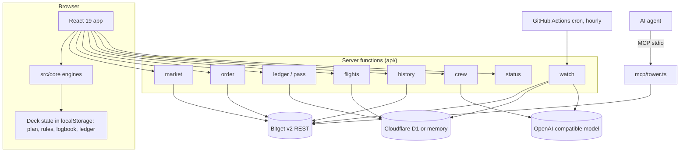

# FLIGHTDECK: technical document

This document describes how FLIGHTDECK works: what each engine computes, the exact thresholds it
uses, how a decision becomes an order on Bitget, what the system does and does not trust, and how
all of it was tested on 95,886 plans it had never seen. Every number here is in the source or is
printed by a script in the repository; file names are given so each claim can be checked.

| If you have | Read |
|---|---|
| Two minutes | Section 1 (principles) and section 17 (what the study found) |
| Ten minutes | Add sections 5 to 8: the checks, the Tower, the re-route, Night Watch |
| A quant's eye | Section 3 (data and its verification), section 17, then [STUDY.md](STUDY.md) |
| An engineer's eye | Sections 2, 11, 12 and 15: architecture, trust model, Bitget calls, tests |

Contents:

1. [Design principles](#1-design-principles)
2. [System overview](#2-system-overview)
3. [Market data and the no-look-ahead rule](#3-market-data-and-the-no-look-ahead-rule)
4. [Departures: the radar](#4-departures-the-radar)
5. [Preflight: eight checks](#5-preflight-eight-checks)
6. [Tower: rules and clearance](#6-tower-rules-and-clearance)
7. [Re-route](#7-re-route)
8. [Flight and Night Watch](#8-flight-and-night-watch)
9. [Black Box](#9-black-box)
10. [The ledger](#10-the-ledger)
11. [Server routes and the trust model](#11-server-routes-and-the-trust-model)
12. [Bitget integration](#12-bitget-integration)
13. [Agents: the MCP Tower](#13-agents-the-mcp-tower)
14. [Where a model is used](#14-where-a-model-is-used)
15. [Testing](#15-testing)
16. [Limits](#16-limits)
17. [The study](#17-the-study)
18. [Glossary](#18-glossary)

---

## 1. Design principles

**Math decides; models argue.** Every decision that moves money (verdict, clearance, re-route,
what Night Watch may do) is a pure TypeScript function. Same inputs, same output. A language
model is used only to put words on numbers the code already produced, or to pick from a fixed
menu whose every item is safe.

**No look-ahead.** An engine judging a plan at time `t` sees only bars that had fully closed by
`t`. This is enforced in one place (`viewAsOf` in `src/core/market.ts`) and tested.

**One code path everywhere.** `src/core/` is imported unchanged by the browser app, the server
functions and the MCP server. The server does not have a second, "trusted" implementation; it
re-runs the same functions on its own data.

**Refusals end with offers.** A refusal that leaves the trader with nothing teaches them to go
around the tool. Every refusal is paired with the largest version of the same trade that clears.

**Honest evidence.** Recorded real candles, deterministic output, a hash chain anyone can
recompute, and limits stated next to claims. The study in section 17 reports the comparisons
FLIGHTDECK loses as plainly as the ones it wins.

**Nothing tuned on the test.** Every threshold in this document was fixed before the study was
run, and none was changed afterwards. The engines in the repository are the engines that were
tested.

## 2. System overview



| Layer | Technology | Notes |
|---|---|---|
| App | React 19, TypeScript, hand-written CSS | Bundled with esbuild only. No UI framework. |
| Engines | TypeScript, zero dependencies | Includes its own synchronous SHA-256 so hashing is identical in every runtime. |
| Server | Serverless functions on Netlify or Vercel | Nine routes. On Vercel each file in `api/` is a function; on Netlify one function (`netlify/api.ts`) receives every `/api/*` request and calls the same handlers. Stateless apart from the optional store. |
| Storage | Cloudflare D1 over REST, or in-memory | Tables `fd_ledger`, `fd_flights`. Optional. |
| Agents | MCP over stdio, no dependencies | Five tools. |
| Tests | `node:test` through `tsx` | 64 tests, a mock exchange, a real SQL engine for the D1 client. |
| Study | `research/`, run with `npm run study` | 968 hourly and 130 daily bars per contract; calls the engines unchanged. Not loaded by the app, apart from one small file of headline figures. |

**The browser is the system of record.** The deck (plan, rules, logbook, ledger) lives in the
browser. The server does two jobs that a browser cannot: it holds exchange keys, and it stays
awake. It mirrors the ledger so decisions can be verified publicly, and it minds flights when the
tab is closed.

## 3. Market data and the no-look-ahead rule

`src/core/market.ts`, `src/core/snapshot-hourly.ts`, `src/core/snapshot-daily.ts`,
`src/core/bitget.ts`

**Recorded feed.** The repository ships real Bitget USDT-M futures candles recorded from the
public market API on 8 October 2026: 168 hourly bars per contract (1 Oct 19:00 UTC to 8 Oct
19:00 UTC) and about 90 daily bars (89 for QQQ, 91 for MSTR, 107 for BTC). Eight contracts: NVDA,
TSLA, AAPL, MSFT, MSTR, COIN, QQQ and BTC. Contract terms (maximum leverage, taker fee, precision,
`isRwa`) were recorded from `/api/v2/mix/market/contracts`; tier-1 maintenance margin was recorded
for NVDA (0.5%) and BTC (0.4%) from `/query-position-lever`.

**Study data.** `research/history-hourly.ts` adds the 800 hourly bars before the app's snapshot
(29 Aug 11:00 UTC to 1 Oct 19:00 UTC) and `research/history-daily.ts` adds 90 daily bars from
31 May, so the study runs on 968 consecutive hours and 130 days per contract. The app does not
load these files.

**How the data was verified.** A price series copied wrongly is the quietest way to get a wrong
result, so every bar is checked three ways, and the checks are tests (`tests/study.test.ts`):

| Check | What it catches | Result |
|---|---|---|
| When recorded, every bar opened exactly at the previous bar's close (the perp never stops trading, so Bitget's bars have no gaps between them); every bar's range contains its open and close | a miscopied or missing row | 0 failures in 7,744 hourly and 720 daily bars |
| The last recorded hour of the study data closes at the price the app's snapshot opens at, for every contract | a wrong join between two recordings | 8 of 8 contracts |
| Daily bars rebuilt from 24 hourly bars equal the daily bars Bitget printed (open, high, low, close) | an error in either recording, since they came from separate API calls | 302 of 302 days recorded independently both ways |
| The app's daily bars against a fresh pull of the same days | drift in the stored snapshot | 411 of 411 bars identical |

Because every bar opens at the previous close, the files store high, low and close only. It also
means a "gap" never appears between hourly bars in this data: a violent move shows up as one tall
bar, and the flight model fills a stop inside it at the stop price less slippage. Section 16
lists that as a limit.

The third check found two bars in the app's daily snapshot that had been recorded before they
closed (MSTR 6 October, BTC 20 September) and showed that the BTC daily series stopped at
20 September. Both were corrected on 9 October from the final Bitget values. No figure in the
demo changed, and `samples/` is byte-identical before and after.

**Live feed.** `loadLiveMarket()` builds the same `MarketState` from four public endpoints
(tickers, 1H candles, 1D candles, contracts) and adds META, AMZN, GOOGL, PLTR, SPY, ETH and SOL
where Bitget lists them. A symbol that fails to load is skipped; it cannot take the board down.

**The simulator clock.** On the recorded feed the clock starts at `SIM_START`, 30 hours before
the recording ends (07 Oct 2026 13:00 UTC). Those 30 hours are the test set: plans are judged
without them and then flown through them.

**`viewAsOf(market, now)`** returns the market with every bar that had not fully closed by `now`
removed. Radar, Preflight, the Tower and re-route only ever receive this view. Stepping a flight
forward is the only code that reads later bars, and it reads them one closed bar at a time.

The study uses a stricter version, `viewAt` in `research/lib.ts`: besides dropping unclosed bars
it keeps at most the last 500 hourly and 90 daily bars, which is what the live app requests from
Bitget (the first 332 of 777 entry hours had between 168 and 499 hourly bars behind them), and
it removes the funding rates, because the only rates on file were printed on 8 October and using
them for a September trade would be reading the future. A test rewrites every bar after the
entry time to nonsense and checks that Preflight and the re-route return exactly the same
answer.

**Session clock** (`src/core/calendar.ts`). US cash hours are 09:30 to 16:00 New York time,
Monday to Friday, with NYSE holidays for 2026 and 2027 and daylight saving handled through the
`America/New_York` time zone. The clock also names the phase: regular, pre-market (04:00 to
09:30), after hours (16:00 to 20:00), overnight, weekend, holiday.

## 4. Departures: the radar

`src/core/radar.ts`

A stock perp trades around the clock; the shares behind it trade six and a half hours a day. The
radar measures how far each contract has moved since its home market last had a say.

For each instrument:

- **Reference point.** For a stock perp with New York closed: the last closing bell. With New
  York open: the opening bell. For crypto: 24 hours ago.
- **Drift.** `last / price_at_reference - 1`.
- **Hourly volatility, split by session.** Hourly log returns are divided into open-market and
  closed-market hours and a standard deviation is taken for each. The board shows both, because a
  stock perp typically moves several times more per hour when New York is open.
- **Sigma.** `z = ln(last / ref) / (sigma_hour * sqrt(hours_since_ref))`, using the volatility of
  the current session type.
- **Residual against a benchmark.** Stock perps are regressed on the QQQ perp, and MSTR and COIN
  on BTC (ordinary least squares on hourly log returns, bars paired by timestamp). The part of
  the drift the benchmark does not explain is `resid = drift - beta * benchmark_drift`, and
  `zResid` is that residual in units of residual volatility.
- **Ranking.** `score = max(|zResid|, 0.5 * |z|)` where a benchmark exists, otherwise `|z|`.

At the demo's start, NVDA is down 0.86% since the close at 1.6 sigma, but its residual against
QQQ is 0.3 sigma: the index moved, not NVIDIA. The radar does not issue signals. It tells the
pilot whether a move is the contract's own.

## 5. Preflight: eight checks

`src/core/preflight.ts`

Inputs: a flight plan (instrument, side, leverage, margin, entry at market, optional stop and
target, hold time), the market as of now, and account equity.

**Typing a trade** (`src/core/parse.ts`). A plan can be written as one line, for example
`20x long NVDA, $400, stop 231, over the weekend`. The line is read by a small deterministic
parser, not a model, so the same words always give the same plan and nothing is invented:

| You write | It reads |
|---|---|
| a ticker or company name (`NVDA`, `Tesla`) | the contract, and the entry at its last price |
| `long`, `buy`, `call` / `short`, `sell`, `fade`, `put` | the side |
| `20x` | leverage |
| `$400`, `400 usdt`, `margin 400` | margin |
| `stop 231`, `sl 231` / `target 251`, `tp 251` | stop and target |
| `2 days`, `36h`, `overnight` (18h), `over the weekend` (72h) | the hold |

Anything the line leaves out keeps its current value, and the app shows back exactly what it
understood ("Read as: NVDA, long, 20x, 400 USDT margin, 72h") before anything is filed.

Shared quantities:

| Quantity | Definition |
|---|---|
| Notional | `margin * leverage` |
| Liquidation price | isolated margin: `entry * (1 - (1/leverage - mmr))` for a long, mirrored for a short |
| Daily volatility `sigmaDay` | standard deviation of daily log returns |
| Horizon volatility `sigmaHorizon` | `sigmaDay * sqrt(holdHours / 24)` |
| Shock | the larger of the worst single-day adverse move in the daily history and a 4-sigma day; capped at a 4-sigma horizon move when the flight starts and ends inside one open session |
| Fees | `notional * takerFee * 2` |
| Funding | `notional * fundingRate * direction / 8` per hour |
| Stop slippage | 0.2% on stock perps, 0.1% on crypto; a bar that opens through the stop fills at the open |

The checks:

| # | Check | Fails when | Cautions when |
|---|---|---|---|
| 1 | Liquidation runway | liquidation is under 2 horizon-sigmas from entry | under 3.5 |
| 2 | Gap shock | the shock reaches the liquidation price | loss at the shock is over twice the planned loss, or the shock is 70% of the way to liquidation |
| 3 | Earnings | the hold crosses a results date and the shock would liquidate it or cost over 5% of the account | the hold crosses a results date at all |
| 4 | Regime replay | 5% or more of past windows end in liquidation | any liquidation, a negative average, or fewer than 10 windows |
| 5 | Stop integrity | no stop, stop on the wrong side, or stop beyond liquidation | stop closer than 0.35 horizon-sigmas (inside noise) |
| 6 | Payoff | reward to risk under 0.5, or the target is on the loss side | under 1, no target, or the replay hit rate is below break-even |
| 7 | Fees and funding | costs exceed 35% of the gross reward | exceed 15% |
| 8 | Risk to account | loss at the stop exceeds 5% of equity | exceeds 2% |

Verdict: **NO-GO** if any check fails, **CAUTION** if any cautions, otherwise **GO**.

**A worked example.** The demo's plan, judged at 13:00 UTC on 7 October 2026 with New York
closed (`samples/preflight-as-filed.json`): NVDA long at 237.32, 20x on 400 USDT, stop 231.39,
target 251.56, 72 hours.

| Check | Result | The number behind it |
|---|---|---|
| Liquidation runway | **fail** | Liquidation at 226.64, 4.5% away. A normal 72-hour move in NVDA is 3.1%, so that is 1.4 moves; under 2 fails |
| Gap shock | **fail** | A 4-sigma day is 7.2%, which is past the liquidation price. The hold crosses 3 opening bells |
| Earnings | pass | Lands before NVIDIA's next results (17 November, estimated) |
| Regime replay | pass | 84 past windows: 5 reached target, 32 stopped out, 0 liquidated, average +10.53 USDT |
| Stop integrity | pass | 2.5% from entry, outside noise and inside liquidation; loss at the stop 209.90 USDT |
| Payoff | caution | 2.24 to 1 needs a 31% hit rate; of 37 replayed flights that reached a level, 14% reached the target |
| Fees and funding | pass | 9.60 USDT round trip, 2% of the gross reward |
| Risk to account | caution | 209.90 USDT is 2.2% of the account |

Verdict NO-GO; survives at 12x. The Tower then applies its own limits (10x on stock perps, 5x
with New York closed) and the re-route lands on 5x.

**How the thresholds held up.** They were fixed before the study in section 17 and not changed
after it. Among 32,634 plans flown with no stop, the share liquidated within a day was 23.9%
with a runway under 1, 22.4% from 1 to 1.5, 1.4% from 1.5 to 2, 1.9% from 2 to 2.5, and 0% above
2.5. So 94.3% of the liquidations were in plans the runway check fails, 5.7% in plans it
cautions and none in plans it passes. The sharp drop in that sample was at 1.5; the fail line at
2 sits on the cautious side of it. The bands are largely labels for leverage and contract, so
this shows the lines are not in the wrong place, not that they are optimal.

**Regime replay.** The exact plan is flown through every past window of the same length, each
window rescaled to start at the plan's entry. Hourly windows are used for holds up to 48 hours
when there is enough history, daily windows otherwise. Adverse levels are tested before
favourable ones inside a bar, so the replay is pessimistic about ordering.

**Reshuffled paths.** One thousand synthetic paths are built by block bootstrap from the same
bars the replay uses (blocks of 6 hourly bars or 2 daily bars, to keep short-range dependence),
seeded from the plan's hash so the result is reproducible. This answers a different question from
the replay: not "what happened in the windows we have" but "what if the same days came in another
order".

The share of those paths that end in liquidation is the forecast the study checks against
reality. For a 50x plan with the default stop held a day it averaged 25.3% across 7,770 plans,
and 24.2% were liquidated (95% interval 19.9% to 28.2%). For 72-hour holds, which fall back to
daily bars, it ran high: 57.6% forecast against 50.7% measured. **It is a base rate and nothing
more.** At a fixed leverage it did no better than quoting the group's average to every plan
(Brier skill between -4% and +11%), and across entry days it was negatively correlated with what
happened. It tells the trader how often this kind of plan dies, not which day.

**Surviving size.** When the verdict is NO-GO, a binary search finds the highest whole-number
leverage at which no check fails (Bitget sets leverage in whole numbers). If the plan fails even at 1x and only the account-risk check is failing,
the margin is reduced instead. If neither helps, the plan is reported as not fixable by size,
with the blocking checks named.

**Earnings.** `src/core/earnings.ts` holds results dates (Tesla 21 October and Apple 2 November,
announced; Microsoft and Nvidia, estimates, labelled). Results land after the close, so the perp
takes the whole reaction with no share trading behind it and a stop does not fill inside the
move. A hold that crosses a date is therefore judged on the gap, not on the stop.

## 6. Tower: rules and clearance

`src/core/tower.ts`

`requestClearance(plan, rules, context)` evaluates every enabled rule and returns CLEARED or
REFUSED with a rule-by-rule finding. It is a pure function.

The charter, which ships with the app and cannot be removed:

| Rule | Limit |
|---|---|
| Fresh preflight on this exact plan | the plan hash must match a preflight under 30 minutes old that is not NO-GO |
| A working stop is filed | the stop must sit between entry and liquidation |
| Risk per flight | at most 5% of the account |
| Leverage on stock perps | at most 10x |
| Leverage on crypto perps | at most 20x |
| Stock perps while New York is closed | at most 5x |
| Grounded after a bad day | no take-off once 6% of the account is lost in 24 hours |
| Orders filed by an agent | at most 5x |

Rule kinds the Black Box can add: `cooldown_after_loss`, `no_size_up_after_loss`,
`max_flights_per_day`, a tighter `offhours_leverage`, and a `max_leverage` across all perps.

The plan hash covers symbol, side, leverage, margin, entry, stop, target, hold and origin.
Changing any of them after preflight invalidates the clearance. An agent cannot preflight one
plan and file another.

## 7. Re-route

`src/core/reroute.ts`

Given a plan the deck will not fly, `reroute()` returns the largest version of the same trade
that passes Preflight and the Tower, or the reasons no size can.

Algorithm:

1. Lower leverage to the highest value any rule allows this filer on this instrument now.
2. If no working stop is filed, add one a normal move for the hold (`sigmaHorizon`) from entry.
3. Run Preflight. If NO-GO, move to the surviving size; if not fixable, stop and report why.
4. Ask the Tower. If cleared, return the plan with a plain-language list of what changed.
5. If the only broken rules are about size (leverage caps, risk per flight, no sizing up after a
   loss), lower leverage or margin accordingly and go to 3.
6. If a broken rule is not about size (cooldown, grounded, flights per day), stop and report it.
   Re-route does not pretend a smaller position fixes a rule about behaviour.

Guarantees, tested over 160 random plans:

- The returned plan clears, and its preflight is not NO-GO.
- Leverage and margin never go up.
- Instrument, side, hold, target, entry and origin never change.
- A working stop is left exactly where the pilot put it.

For a pilot, accepting the re-route files it and issues the pass in one click. For an agent, the
re-route is returned as a counter-offer that must be preflighted and refiled unchanged. Both are
written to the ledger.

**Measured.** Across 95,886 plans in the study the re-route always found a size (none was
refused outright), averaged 6.2x, and none of its flights was liquidated in any of the three
tests, against 1,881, 3,693 and 2,758 as filed. That is the lower leverage at work: the same
plans at the re-routed leverage with no stop would not have been liquidated either. It kept 28%
to 29% of the gains and 26% to 27% of the losses. Against a flat 6x cap carrying the same
total exposure, its average result was the same; its worst outcomes were better when the plan
had been filed with no stop and worse when the plan carried a fixed 2.5% stop, because a uniform
leverage gives the smallest worst case when every stop is the same distance away. The limits the
re-route works within are sensible caps, not an optimal allocation, and the document does not
claim otherwise.

## 8. Flight and Night Watch

`src/core/flight.ts`, `src/core/nightwatch.ts`, `src/core/watchman.ts`

**Flight.** A cleared plan becomes a flight. Each closed hourly bar is applied in order: stop
first (with slippage, or the bar's open if it gapped through), then liquidation, then target,
then the hold time. Loss never exceeds margin. Partial closes bank their result.

**Night Watch** runs after each closed hourly bar on every flight it minds. It assesses, decides,
passes the decision through a guard, and acts.

What it measures: result in units of planned risk (R), the best R reached, consecutive hourly
closes against the position, runway to liquidation in normal four-hour moves, the session and
hours to the next bell, off-hours drift against the position in sigma, hours to earnings.

The built-in policy, most urgent first:

| Rule | Trigger | Action |
|---|---|---|
| Runway alarm | liquidation closer than 1.5 normal four-hour moves | land |
| No unattended earnings | results within 2 hours | land |
| Pre-bell de-risk | opening bell within an hour and a 2-sigma off-hours drift against the position | cut half |
| Slow bleed | at -0.6R or worse after three or more straight hourly closes against | cut half |
| Trail | best price reached 2R | stop follows 1R behind the best price |
| Free ride | best price reached 1R | stop moves to entry |

**The guard** is the safety property of the whole feature:

- Hold and land are always allowed.
- Cut is allowed while anything is open.
- A stop move is allowed only if it moves toward the price and is not already through the market.
- Nothing else exists. There is no action that adds size, widens a stop or removes one.

A model may be asked to choose the action instead of the built-in policy. Its reply goes through
the same guard; a reply that fails is discarded and the built-in policy is used. A wrong answer
from a model can therefore cost opportunity, never extra exposure. A test flies 300 random
flights against random proposals and checks after every step that exposure did not grow and no
stop moved away or disappeared.

**Comparisons on landing.** Two counterfactuals are computed over the same hours, with no
forecasting: the plan as first filed (before re-route), and the cleared flight with Night Watch
off. They are shown on every landing where they differ.

**Measured.** In the study Night Watch acted on 22% of day-long flights and 56% of three-day
flights. On the flights it touched, the average result did not change (differences of -0.15,
-0.32 and +0.54 USDT in the three tests, every interval spanning zero). The mean of the worst 5%
improved by 13 to 19 USDT, and the median fell from a small gain to a scratch, because moving a
stop to entry at 1R turns some winners into break-evens. That is the profile of a rule that can
only reduce risk: a thinner tail, paid for with some upside. Two cautions. The flight model
fills Night Watch's cuts at the close of the bar it has just seen with no slippage; charged the
same slippage as a stop, its average effect becomes about -1 USDT per flight. And its two
emergency rules, the runway alarm and landing before earnings, never fired in the sample, so the
study is silent on the nights it exists for.

**With the tab closed.** `api/watch` runs the same tick for every stored flight. A GitHub Actions
workflow calls it hourly with a bearer secret. When the flight was opened on Bitget, Night
Watch's cuts and landings are sent as close orders.

## 9. Black Box

`src/core/blackbox.ts`, `src/core/logbook.ts`

The Black Box reads closed flights and looks for six habits. A habit becomes a proposed rule only
if at least three flights show it and together they lost money.

| Leak | How it is detected | Proposed rule |
|---|---|---|
| Revenge flights | take-off within 30 minutes of a losing landing | 60-minute cooldown after a loss |
| Sizing up after a loss | within 6 hours of a loss, at least 25% larger than the losing flight | no larger position for 6 hours after a loss |
| Leverage while New York is shut | stock-perp flights above 3x opened off-hours, compared with those at 3x or less | off-hours cap of 3x |
| Overtrading | the sixth and later flights of a day | five flights per 24 hours |
| Flying without a stop | losing flights with no stop, or liquidations (imported history that cannot say is not accused) | a working stop is required |
| Where your edge ends | the leverage above which cumulative results turn down | a leverage cap at that level |

Adopting a rule writes it into the Tower and the ledger. A proposed rule the charter already
enforces is recognised and not duplicated.

**Sources of history.** The synthetic sample logbook (labelled as such in the app), a CSV import,
or the pilot's real Bitget history through their own key: `history-position` gives closed
positions and results, `orders-history` supplies leverage.

**Counterfactual.** The logbook is re-flown through the current Tower and every flight it would
refuse is dropped. This assumes a refused flight is simply not flown, which flatters the result,
and the app says so next to the figure.

## 10. The ledger

`src/core/tower.ts`, `src/core/util.ts`, `src/core/watchman.ts`

Every clearance, refusal, take-off, Night Watch action, landing and rule change is an entry:

```
hash = SHA-256( prev_hash + canonical_json({ seq, at, kind, summary, body }) )
```

The first entry chains from 64 zeros. `canonical_json` sorts keys and drops undefined values, so
the hash does not depend on property order. `verifyLedger()` recomputes the chain and returns the
first broken sequence number.

**Public mirror.** With storage configured, the browser publishes new entries to `api/ledger`.
The server accepts an entry only if it chains from the entry it already holds, and recomputes the
hash of entries it already has, so a resend with altered content is rejected even when the hash
field matches. A boarding pass link (`?pass=deck.seq`) opens `api/pass`, which re-verifies that
entry against its neighbour at read time.

What this proves: that a decision was recorded with exactly this content, in this order, and has
not been edited since it was published. It is tamper-evidence, not a signature.

## 11. Server routes and the trust model

| Route | Purpose |
|---|---|
| `GET /api/market` | live Bitget market state for the whole board in one call |
| `GET /api/status` | what this deployment is wired to (trading mode, model, storage) |
| `POST /api/order` | the only door to the exchange |
| `POST /api/crew` | the model's three briefs against a preflight report |
| `POST /api/history` | a visitor's own Bitget history, read-only |
| `GET/POST /api/ledger` | the published ledger; appended only if it chains |
| `GET /api/pass` | one published decision, re-verified |
| `GET/POST /api/flights` | flights handed to Night Watch |
| `/api/watch` | one Night Watch round over every stored flight |

**`api/order` trusts nothing from the browser.** It loads live Bitget data itself, rejects a plan
whose entry is more than 1% from the live price, re-runs Preflight, and re-runs the Tower. The
charter always applies on the server; a client can send learned rules, which can only add
restrictions, and cannot remove a charter rule. Only a plan the server itself clears is signed.
Without keys, the route is a dry run that returns the exact order it would have sent.

**Keys.**

- Operator keys live in server environment variables and are never sent to the browser.
- A visitor's own key travels in one request body, signs that request's calls, and is dropped.
  It is not written to storage or to a log.
- A visitor key can place Demo Trading orders only, whatever the operator's settings.
- Real-money trading requires `BITGET_TRADING_MODE=live` on the operator's own keys. The default
  is demo.
- `CRON_SECRET` protects `api/watch`; `FLIGHTDECK_OPERATOR_KEY` can require a key on every write.

## 12. Bitget integration

`src/core/bitget.ts`

| Call | Use |
|---|---|
| `GET /api/v2/mix/market/tickers` | last price, index price (basis), funding rate |
| `GET /api/v2/mix/market/candles` | 1H and 1D history |
| `GET /api/v2/mix/market/contracts` | max leverage, taker fee, precision, `isRwa` |
| `POST /api/v2/mix/account/set-leverage` | set the cleared leverage before the order |
| `POST /api/v2/mix/order/place-order` | market order, isolated margin, with preset stop-loss and take-profit |
| `POST /api/v2/mix/order/place-order` (close) | Night Watch cuts and landings |
| `GET /api/v2/mix/position/history-position` | closed positions for the Black Box |
| `GET /api/v2/mix/order/orders-history` | leverage for those positions |

Signature: `base64( HMAC-SHA256( secret, timestamp + METHOD + path[?query] + body ) )`, checked
by a test against `node:crypto`. Demo Trading requests carry the `paptrading: 1` header. Order
size is rounded down to the contract's volume precision and leverage is sent as a whole number,
rounded down, so an order is never larger than what was cleared. The stop and target are rounded
to the contract's price precision.

The `isRwa` flag from the contracts endpoint is what classifies a contract as a stock perp, which
is what switches on the session rules, the off-hours leverage cap and the earnings check.

## 13. Agents: the MCP Tower

`mcp/tower.ts`, `skills/flightdeck/SKILL.md`

A dependency-free MCP server over stdio. Tools:

| Tool | What it does |
|---|---|
| `flightdeck_radar` | the departures ranking, read-only |
| `flightdeck_preflight` | the eight checks on a plan; must be run before clearance |
| `flightdeck_clearance` | files the plan; returns CLEARED with the exact order, or REFUSED with reasons and a counter-offer |
| `flightdeck_rules` | the rules in force, including learned ones |
| `flightdeck_ledger` | verifies the chain and returns recent entries |

Constraints on agents:

- A lower leverage cap than the pilot (5x under the charter).
- The entry is the market price as the Tower sees it; the agent cannot supply its own.
- A preflight counts only if the agent ran it, in this session, on the exact plan it then files.
- The pilot's learned rules apply: copy the licence JSON from the app to
  `~/.flightdeck/licence.json`.
- A cleared response contains the exact order to place through Bitget Agent Hub. The skill file
  instructs the agent to place that order unchanged and to treat a refusal as final apart from
  the counter-offer.

The Tower enforces what it can observe: it decides whether to hand over an order. It cannot stop
an agent that holds exchange keys of its own from ignoring it. That is why the recommended
arrangement is for the Tower, not the agent, to hold the keys (`FLIGHTDECK_EXECUTE=1`), so the
only path to the exchange runs through a clearance.

## 14. Where a model is used

`src/core/crew.ts`, `src/core/llm.ts`, `src/core/nightwatch.ts`

Any OpenAI-compatible `chat/completions` endpoint works: the hackathon Qwen proxy, Gemini,
Claude, or a local model.

**The crew.** Three seats (Weather, Engineering, Dispatch) argue against the plan. The model
receives the preflight report as JSON and is told to use only those numbers and to invent no
price, statistic, news or forecast. Its reply must be JSON with exactly the three seats or it is
discarded. With no model configured, the same three briefs are written from the report by
templates, so the crew is always present. Either way the briefs are commentary: nothing reads
them back into a decision.

**Night Watch.** Optionally, the model chooses among hold, stop-to-entry, cut-half and land. The
reply passes through the guard described in section 8.

The model is never given a tool, a key, or a field that the decision code reads.

## 15. Testing

`npm test` runs 64 tests. The ones that carry the claims in this document:

| Claim | Test |
|---|---|
| No look-ahead | `viewAsOf never shows a bar that had not closed` |
| Preflight is deterministic and the surviving size really passes | two preflight tests |
| Lower leverage never fails more checks | monotonicity test |
| Replay accounts for every window; loss never exceeds margin | replay test |
| The Tower refuses without preflight and when the plan changes | tower tests |
| Re-route always clears and never raises anything | 160 random plans |
| Night Watch can only reduce risk | 300 random flights against random proposals |
| The ledger detects tampering | chain test; the mirror refusing rewrites |
| Request signing | compared with `node:crypto` |
| The server refuses what the charter refuses, whatever the client says | order-route test |
| A visitor key places demo orders only | order-route test |
| The D1 client works against a real SQL engine | `node:sqlite` test |
| The study's candles are continuous and join the app's snapshot at the same price | two `study data` tests |
| Daily bars rebuilt from hourly bars equal the daily bars Bitget printed | `study data` test, over 300 days |
| The study never hands an engine a bar that had not closed | `study` test |
| Rewriting every bar after the entry changes nothing the engines say | `study` test, on three contracts at four dates, both sides |
| The forward test pages through new candles, appends only closed bars that join, and refuses a response with a missing hour | three `forward test` tests against a stand-in endpoint |
| A study slice is deterministic, and no re-route in it raises leverage or margin | `study` test |

The live path is tested against `tests/mock-bitget.ts`, a stand-in shaped like Bitget's v2
responses that checks the signature and the demo header on every signed call. `npm run demo`
runs the whole loop headless and writes the files in `samples/`; run it twice and the files are
byte-identical.

## 16. Limits

- The app's recorded feed is short: seven days hourly, about ninety days daily. Volatility and
  the shock are estimated from it, so a calm ninety days understates a real tail. The live feed
  and the study use 500 hourly bars.
- The two demo flights show the mechanism. The evidence is the study, and it has limits of its
  own: 40 days of a rising market with no crash and no earnings date, eight contracts that share
  one market, hourly bars, and no event large enough to test the gap check. It shows no edge on
  direction and no advantage over a flat leverage cap on the average result. Section 17 and
  [STUDY.md](STUDY.md) set these out.
- Preflight's liquidation forecast was right on the rate for one-day holds and about seven
  points high for three-day holds, which are replayed on daily bars. It is a base rate, with no
  skill at saying which plans at a given leverage will be liquidated.
- The flight model works on hourly bars of last-traded prices. Inside an hour it assumes a stop
  fills before liquidation, and at its price less slippage however fast the hour moved; an
  exchange liquidates on mark price; and the liquidation price here ignores the closing fee.
  `research/AUDIT.md` measures how much each of these moves the results.
- Maintenance margin is tier 1. Large positions sit in higher tiers and liquidate earlier than
  shown. Rates were recorded for NVDA and BTC; other contracts use an assumed rate.
- Night Watch on the server works from hourly candles. It cannot react inside an hour, and the
  exchange's own stop fill can differ from the modelled one. Its stop moves are enforced on its
  next round rather than sent to Bitget as amended orders.
- Earnings dates for Microsoft and Nvidia are estimates. Coinbase and Strategy have none on file.
- Response field names for account history follow Bitget's documentation and a mock built from
  it; they have not been confirmed against a live account in this build.
- Spot tokens, including Bitget's Ondo tokenized stocks, are out of scope. They have no leverage
  and no liquidation, so these checks do not apply.
- There are no user accounts. A deck belongs to a browser.
- FLIGHTDECK judges position size and survival. It has no opinion on direction and is not advice.

## 17. The study

`research/run.ts`, `research/report.ts`, `research/audit.ts`, `research/forward.ts`, `research/lib.ts`,
[STUDY.md](STUDY.md), [research/RESULTS.md](../research/RESULTS.md),
[research/AUDIT.md](../research/AUDIT.md)

Two demo trades can be picked. The study removes the picking: every entry hour, every contract,
both sides, three leverages.

**Design.**

| | |
|---|---|
| Plans | 95,886 across three tests: the app's default stop and target held 24 hours (32,634), the same held 72 hours (30,618), and a plan with no stop held 24 hours (32,634). The tests share hours and contracts and are not independent |
| Grid | 8 contracts, 777 entry hours over 33 days (5 September to 7 October 2026), long and short, 10x, 20x and 50x where Bitget allows it |
| What the engines see | Up to 500 hourly and 90 daily bars closed before the entry: what the live app requests |
| Versions flown | As filed; re-routed; re-routed with Night Watch; and a flat leverage cap for comparison |
| Rules | The charter. No learned rules, clean logbook |
| Scoring | `src/core/flight.ts` unchanged: stop with slippage, liquidation, target, hold; taker fees both sides |
| Intervals | 1,000 resamples of whole entry days, so trades that share a market stay together |
| Checks on the study itself | A second implementation of the flight (`audit.ts`), which agrees on all 95,886 plans; the main results recomputed under changed assumptions; an independent review |

**Findings.**

| # | Finding | Figure |
|---|---|---|
| 1 | A 50x plan with the default stop is liquidated about one day in four | 24.2% (95% interval 19.9% to 28.2%); 50.7% over three days |
| 2 | Preflight had that rate right beforehand | average forecast 25.3%; 57.6% for three days, seven points high |
| 3 | The forecast is a base rate, with no skill beyond it | at a fixed leverage, Brier skill between -4% and +11% over quoting the average; negative correlation with outcomes by day |
| 4 | Liquidations of unstopped plans fall in the zones the runway check flags | 94.3% in its fail zone, 5.7% in caution, none in pass |
| 5 | Nothing that was cleared was liquidated | none in any test, against 1,881, 3,693 and 2,758 as filed; a leverage effect |
| 6 | A month of the 50x habit | 7.8 liquidations, median -1,478 USDT on 10,000; re-routed -114 |
| 7 | The cost is proportional | 28% to 29% of gains kept, 26% to 27% of losses kept |
| 8 | No better than a flat 6x cap on the average | differences of +0.27, +0.56 and -0.43 USDT, all intervals spanning zero |
| 9 | Worst cases against the flat cap depend on the stop | +32.92 USDT better with no stop filed; -18.99 and -44.01 worse with a fixed 2.5% stop |
| 10 | Night Watch trims the tail and does not help the average | worst 5% better by 13 to 19 USDT; mean about -1 USDT once its exits pay slippage |
| 11 | The app's own default (20x, 72 hours, stop 2.5%) was never liquidated as filed | but 37.9% of those trades lost more than 2% of the account |

Findings 3, 8, 9 and 10 are the ones that do not flatter the product. They are in the table
because a result that only ever agrees with its author is not a result.

**Sensitivity** (`research/AUDIT.md`). Counting every hour in which both the stop and the
liquidation price were reached as a liquidation raises the 20x rate from 0% to at most 1.2%
(1.9% over three days). Including the closing fee in the liquidation price raises the 50x rate
from 24.2% to 25.6%. Halving the assumed maintenance margin on MSTR, COIN and QQQ lowers their
unstopped 20x rate from 14.9% to 12.2%. None of these changes a conclusion.

**What was changed afterwards.** The two partially recorded daily bars described in section 3.
No threshold, rule or formula: the commit that adds the study changes no engine file in
`src/core/`. The changes the findings point to (keying the off-hours cap on whether the hold
crosses a close, a risk-based re-route, a later trigger for Night Watch's stop-to-entry, the
closing fee in the liquidation price, a better model for long holds) are listed in STUDY.md as
next work, to be tested on data that did not suggest them.

**Reproduce.** `npm run study` (about 90 minutes on one core) rewrites `research/RESULTS.md`,
`research/AUDIT.md` and `research/headline.json`. The landing page of the app reads its figures
from that last file, so the page cannot drift from the study.

**The forward test** (`research/forward-fetch.ts`, `research/forward.ts`,
`.github/workflows/forward-test.yml`). The study is frozen at 8 October 2026 19:00 UTC. Each
Monday a scheduled job fetches the hourly candles printed since then from
`/api/v2/mix/market/history-candles` (200 per page, walking back from the present), keeps only
bars that have closed, follow the last one held hour by hour and open where it closed, and
appends them to `research/forward-hourly.json`; if any contract fails those checks nothing is
written. It then flies the Day test's plans on every entry hour whose flight ends after the
freeze, with the engines unchanged, and commits `research/FORWARD.md`: the 50x liquidation rate
against the forecast, liquidations as filed against re-routed, and average and worst results, by
week and in total. The frozen study never reads the forward file, and the engines never read the
forward results: the job keeps score and tunes nothing. It needs no secrets. It is tested
against a stand-in endpoint and first ran on GitHub on 9 October 2026. The running total is
written under the `forward` key of `research/headline.json`, which the landing page reads, so
the site shows the latest forward score and is rebuilt after every run.

## 18. Glossary

| Term | Meaning |
|---|---|
| Flight plan | A trade before it is placed: contract, side, leverage, margin, stop, target, hold |
| Preflight | The eight checks on a plan |
| GO / CAUTION / NO-GO | No check cautions or fails / at least one cautions / at least one fails |
| Runway | Distance from entry to the liquidation price, in normal moves for the hold |
| Normal move | One standard deviation of the contract's return over the hold |
| Shock | The contract's worst recent single-day move against the position, or a 4-sigma day if larger |
| Tower | The rule set that clears or refuses a plan |
| Charter | The eight rules the Tower ships with, which cannot be removed |
| Clearance / boarding pass | A recorded CLEARED decision on one exact plan, identified by its hash |
| Re-route | The largest version of a refused plan that would clear |
| Counter-offer | A re-route returned to an AI agent |
| Flight | A cleared plan that has been opened |
| Landing | A flight closing: at its stop, its target, liquidation, the end of the hold, or by Night Watch |
| R | The planned risk: the distance from entry to the stop as cleared |
| Night Watch | The hourly check on open flights that can only reduce risk |
| Guard | The function that rejects any Night Watch action that would add risk |
| Black Box | The reader of closed flights that proposes new Tower rules |
| Leak | A habit in the logbook that lost money |
| Ledger | The hash-chained record of every decision |
| As filed | The plan exactly as the trader or agent first wrote it |
| Worst 5% | The average of the worst twentieth of results (expected shortfall) |
| Stock perp | A perpetual future on a share (NVDA, TSLA and so on), flagged `isRwa` by Bitget |
